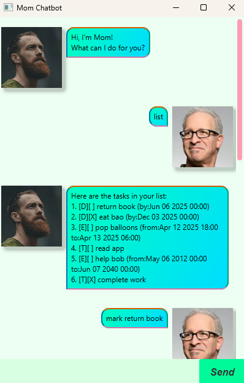
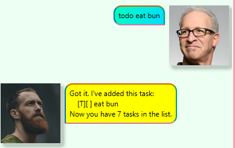
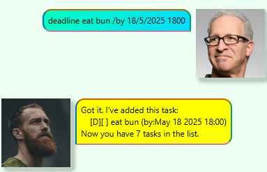
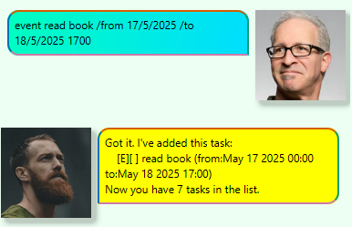
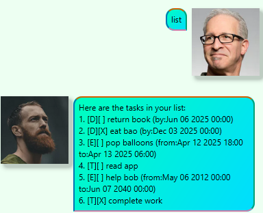
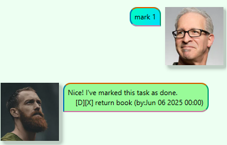
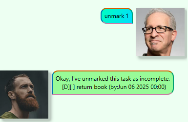
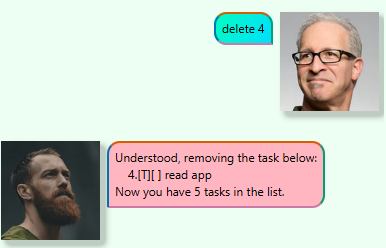
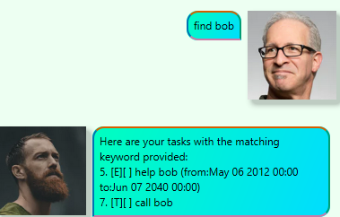

# *Mom* Chatbot User Guide
 

 
The Mom chatbot is a simple desktop chatbot app which main purpose is to help you keep track of tasks and deadlines.
While it has the benefits and appearance of a Graphical User Interface(GUI), it is optimized to be used via a Command
Line Interface(CLI). The faster you type the faster you can get the Mom chatbot to execute different commands and manage
your to do list faster!

---

## How to Start

1. Ensure that you have Java 17 installed on your computer.
2. Download the latest `.jar` release file of the Mom chatbot. If you want the `.jar` file to run and your tasklist file to
be stored in a specific folder, copy the file to the desired folder.

# Features

Notes about the command format:

- Words in `UPPER_CASE` are the parameters to be supplied by the user.

  e.g. in `todo DESCRIPTION`, `DESCRIPTION` is a parameter which can be used as `todo read book`.
- Items in square brackets are optional.

    e.g `DATE [TIME]` can be used as `18/5/2025` or `18/5/2025 5pm`.
- Helping words like `/from`, `/to`, `/by` are to be supplied by the user.
- Extraneous parameters for commands that do not take in parameters (such as `list`, `undo`) will be ignored.

## Adding Todo tasks: `todo`
Adds a todo type task to the task list.

Format: `todo DESCRIPTION`

Examples:
- `todo read book`
- `todo eat bun`

A reply including the task added will be printed out by the chatbot.
 

 
## Adding Deadline tasks: `deadline`
Adds a deadline type task to the task list. If no time is specified, the time is set by default to 00:00.

Format: 
- `deadline DESCRIPTION /by DATE [TIME]`

Examples:
- `deadline read book /by 18/5/2025 `
- `deadline eat bun /by 18/5/2025 1800`

A reply including the task added will be printed out by the chatbot.
 

 
## Adding Event tasks: `event`
Adds an event type task to the task list. If no time is specified, the time is set by default to 00:00.

Format:
- `event DESCRIPTION /from DATE [TIME] /to DATE [TIME]`

Examples:
- `event read book /from 17/5/2025 2pm /to 18/5/2025 1700`
- `event read book /from 17/5/2025 2pm /to 18/5/2025`
- `event read book /from 17/5/2025 /to 18/5/2025 1700`
- `event read book /from 17/5/2025 /to 18/5/2025`

A reply including the task added will be printed out by the chatbot.
 

 
## Listing tasks: `list`
Prints the task list.

Format: `list`

The task list will be printed out by the chatbot.
 

 
## Mark a task: `mark`
Marks a task as complete. If the task has already been marked as complete, the task status will remain as complete.

Format: `mark RANK`

Example: `mark 1`

A reply including the task marked will be printed out by the chatbot.
 

 
## Unmark a task: `unmark`
Unmarks a task as incomplete. If the task has already been marked as incomplete, the task status will remain as incomplete.

Format: `unmark RANK`

Example: `unmark 1`

A reply including the task unmarked will be printed out by the chatbot.
 

 
## Delete a task: `delete`
Deletes a task in the task list given the rank of the task in the task list.

Format: `delete RANK`

Example: `delete 1`

A reply including the task deleted will be printed out by the chatbot.
 

 
## Locating a task by keyword: `find`
Finds existing tasks with the corresponding keyword in the description. If no corresponding task is found, no tasks will be printed.

Format: `find KEYWORD`

Example: 
- `find book`
- `find read book`

All task entries containing the corresponding keyword will be printed out by the chatbot.
 

 
## Undo a command: `undo`
Reverts the task list to the state before the last command.

Format: `undo`

The user's `undo` command will not be printed out but the task list will be reverted to the state before the last command and the following reply from the chatbot will appear.
 

 

## Exit the chatbot program: `bye`
Saves the current task file to the hard disk and closes the chatbot window.

Format: `bye`

## Saving the data
The task list data is saved in the hard disk automatically after any command that changes the data. There is no need to save manually.

## Loading the data
The task list data is loaded from the hard disk automatically when the chatbot is started. If there is no existing data file, a new data file will be created.

---
# Command Summary
| Command  | Format                                                | Example                                                  |
|----------|-------------------------------------------------------|----------------------------------------------------------|
| todo     | `todo DESCRIPTION`                                    | `todo read book`                                         |
| deadline | `deadline DESCRIPTION /by DATE [TIME]`                | `deadline read book /by 18/5/2025`                       |
| event    | `event DESCRIPTION /from DATE [TIME] /to DATE [TIME]` | `event read book /from 17/5/2025 2pm /to 18/5/2025 1700` |
| list     | `list`                                                | `list`                                                   |
| mark     | `mark RANK`                                           | `mark 1`                                                 |
| unmark   | `unmark RANK`                                         | `unmark 1`                                               |
| delete   | `delete RANK`                                         | `delete 1`                                               |
| find     | `find KEYWORD`                                        | `find book`                                              |
| undo     | `undo`                                                | `undo`                                                   |
| bye      | `bye`                                                 | `bye`                                                    |